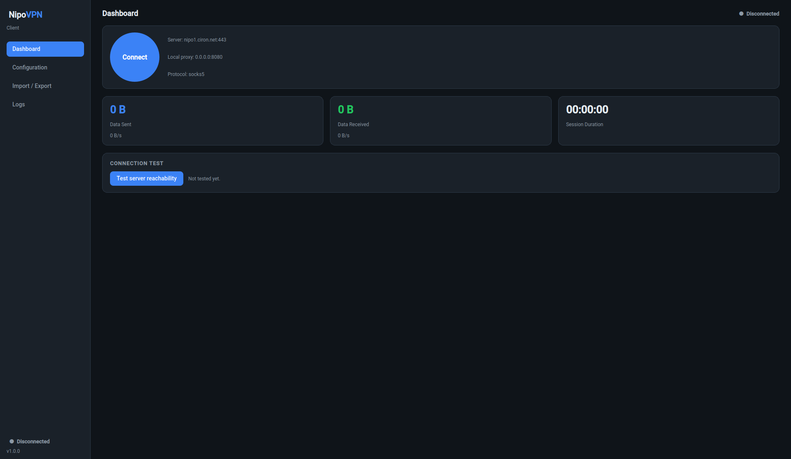

# NipoVPN GUI Client

A modern desktop client for [NipoVPN](../README.md), built with **Python +
PySide6 (Qt 6)**. It drives the NipoVPN C++ core in **agent** (client) mode:
the core listens on a local port and forwards your obfuscated HTTP traffic to a
NipoVPN server defined in `config.yaml`.



## Features

- **Built-in base64 config import** – paste a base64 blob (YAML or JSON,
  standard or URL-safe, padding optional) and the client decodes and loads it.
- **Manual config import** – edit every field of the configuration in a form
  (token, protocol, server IP/port, local listen port, fake URLs, TLS, …).
- **Import core file** – point the client at the compiled `nipovpn` binary.
- **Import / Export `config.yaml`** – load an existing config or save the
  current one to disk. A base64 export is also available for easy sharing.
- **Connection test** – TCP reachability + latency check against the server.
- **Data sent / received** – live traffic counters and transfer rates while
  connected (with an optional per-interface selector).
- **Modern design** – dark theme, sidebar navigation, status cards and a live
  log console.

## Requirements

- Python 3.10+
- The packages in [`requirements.txt`](requirements.txt) (`PySide6`, `psutil`,
  `PyYAML`).
- The NipoVPN core binary (build it from the repo root – see the main
  [README](../README.md) and [build guide](../guides/BuildLinux.md)).

## Install & Run

```bash
cd gui
python -m venv .venv
source .venv/bin/activate          # Windows: .venv\Scripts\activate
pip install -r requirements.txt
python main.py --icon /path/to/your-icon.png
```

If you do not pass `--icon`, the app looks for `app.ico` or `app.png` next to
the launcher or inside an `assets/` folder in packaged builds.

Put your icon file in `gui/assets/` as `app.ico` or `app.png` to make it the
default icon for both development runs and packaged builds.

## Usage

1. Open **Configuration → Import core file** and select the compiled `nipovpn`
   binary.
2. Load a configuration via **Import / Export → Base64 Config Import**,
   **Configuration → Import config.yaml**, or by filling in the form manually.
   Click **Apply** to save your edits.
3. (Optional) On the **Dashboard**, click **Test server reachability** to verify
   the server is up.
4. Click **Connect**. The client starts `nipovpn agent <config.yaml>` and the
   dashboard shows live data sent/received and the session duration.
5. Configure your browser/system to use the local proxy
   (`agent.listenIp:agent.listenPort`, default `127.0.0.1:8080`).

> **Note on traffic stats:** NipoVPN does not create a dedicated tunnel
> interface, so throughput is measured from host network counters via `psutil`.
> Use the **Traffic NIC** selector on the **Logs** page to attribute traffic to
> a specific interface.

## Development

```bash
cd gui
pip install -r requirements-dev.txt
QT_QPA_PLATFORM=offscreen python -m pytest
```

The non-UI logic (config model, base64 decoding, connection test, traffic
monitor, formatting) is fully unit tested and Qt-free.

## Desktop Builds

The GUI is packaged with `PyInstaller`, so build it on each target operating
system:

```bash
cd gui
pip install -r requirements-dev.txt
python build_gui.py --onedir --icon assets/app.ico
```

- Windows produces `dist/nipovpn-gui/`.
- Linux produces `dist/nipovpn-gui/`.
- If you want to ship the core binary alongside the GUI, pass it with
  `--core ../build/core/nipovpn` on Linux or `--core ..\\build\\core\\nipovpn.exe`
  on Windows after building the core for that platform.
- The GUI will also look for a bundled core binary next to the app at launch,
  so a packaged bundle can start immediately when the binary is included.

## Project layout

```
gui/
├── main.py                     # launcher
├── nipovpn_gui/
│   ├── app.py                  # QApplication entry point + theme
│   ├── config_model.py         # NipoConfig: YAML/base64 import & export
│   ├── config_page.py          # manual configuration form
│   ├── connection_test.py      # TCP reachability/latency test
│   ├── traffic.py              # data sent/received monitor (psutil)
│   ├── vpn_controller.py       # runs the core binary (QProcess)
│   ├── main_window.py          # main window / pages
│   ├── widgets.py              # reusable UI widgets
│   ├── theme.py                # dark theme stylesheet
│   └── utils.py                # formatting helpers
└── tests/                      # pytest suite
```
